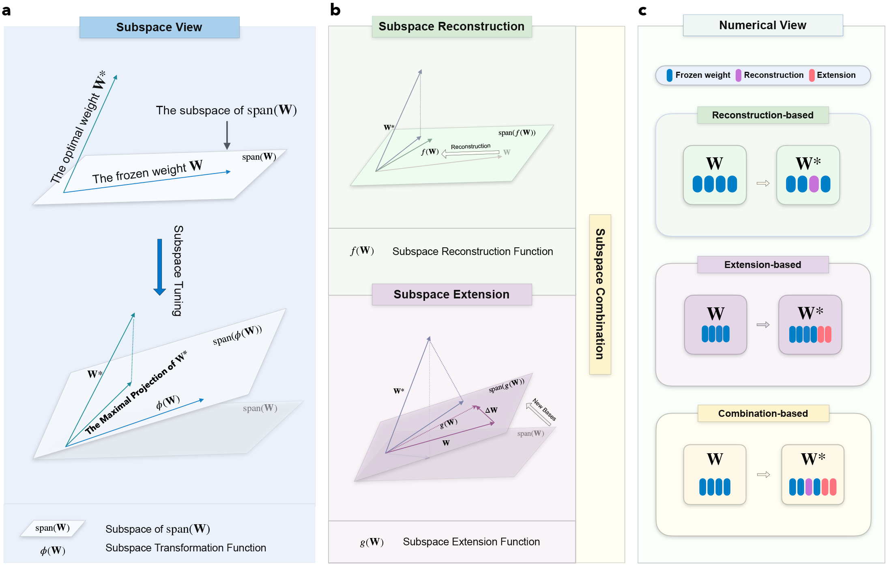
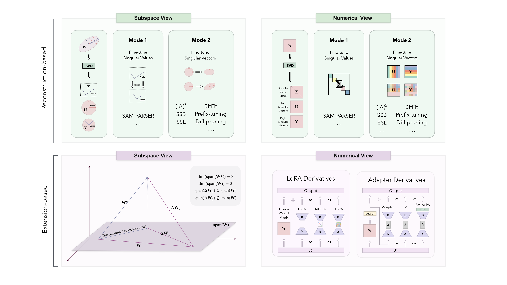
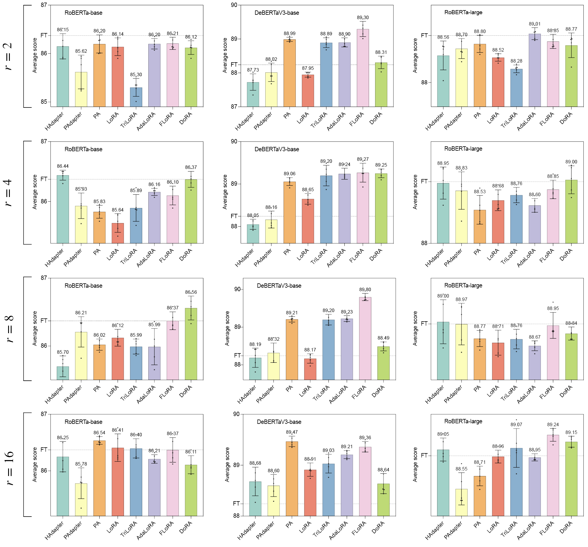

<div align="center">
  <a href="https://github.com/Chongjie-Si/Subspace-Tuning/">
    
</a>
  <div>&nbsp;</div>
  <div align="center">
    <b><font size="5">A Generalized Framework of Subspace Tuning for PEFT</font></b>
  </div>
  <div>&nbsp;</div>

  <div style="display: inline-block;">
    <a href="https://github.com/Chongjie-Si/Subspace-Tuning/blob/main/LICENSE" title="License">
      
    </a>
    <a href="https://github.com/Chongjie-Si/Subspace-Tuning/issues" title="Issues or Pull Requests">
      
    </a>
    <a href="https://github.com/Chongjie-Si/Subspace-Tuning/stargazers" title="GitHub Repo stars">
      
    </a>
  </div>

  <div>
    <a href="#introduction">📘 Introduction</a> |
    <a href="#news">💥 News</a> |
    <a href="#usage">🛠️ Usage</a> |
    <a href="#tasks"> 🎯 Tasks </a>|
    <a href="#algorithms">🔍 Algorithms</a> |
    <a href="https://github.com/Chongjie-Si/Subspace-Tuning/issues/new/choose">🤔 Reporting Issues</a> |
    <a href="mailto:chongjiesi@sjtu.edu.cn?subject=Contact%20Us">📧 Contact Us</a>
  </div>
</div>

## <a id="introduction">📘 Introduction</a>

Welcome to our repository, which contains a diverse collection of Subspace Tuning methods for Parameter-Efficient Fine-Tuning (PEFT). Subspace Tuning are essential for adapting large pre-trained models to specific tasks with minimal changes to the original parameters. It endeavors to identify the maximal projection of the optimal weight $\mathbf{W}^{*}$ onto the subspace spanned by the bases of $\phi(\mathbf{W})$, where $\phi(\mathbf{W})$ denotes the subspace transformation of the original frozen weight $\mathbf{W}$. For more details, please refer to [the original paper]().



We aim to provide a comprehensive resource for researchers and practitioners in this field, and facilitate easy integration into your projects. Whether you are here to find resources for your projects or to contribute, we hope this repository will be a valuable and inspiring part of your research journey.

## <a id="news">💥 News</a>

- **[2024.07.09]** 🔥🔥 Repository Constructed!

## 📝 Todo List

- [ ] Task: Visual Instruction Tuning
- [ ] Task: Image/Video-Text Understanding
- [ ] Method: Spectral Adapter

## <a id="usage">🛠️ Usage</a>

To use the algorithms in this repository, clone the repository and install the necessary dependencies.

1. Clone this Repository:

    ```bash
    git clone https://github.com/Chongjie-Si/Subspace-Tuning.git
    cd Subspace-Tuning
    ```

2. Follow the Instructions in Each Folder.

## <a id="tasks">🎯 Tasks</a>

We support several tasks including:

- Natural Language Understanding ([NLU](./NLU/))
- Natural Language Generation ([NLG](./NLG_QA/))
- Question Answering ([QA](./NLG_QA/))
- Commonsense Reasoning ([CR](./CR/))
- ...

## <a id="algorithms">🔍 Algorithms</a>

Based on subspace tuning theroy, PEFT methods are classified into three categories: reconstruction-based, extension-based and combination-based.



We implement different methods mainly in [loralib/](./loralib/loralib/).
<div style="display: flex;">
<table cellspacing="0" cellpadding="5" style="border-collapse: collapse; width: 100%; max-width: 800px;">
  <thead>
    <tr style="background-color: #f2f2f2;">
      <th style="border: 1px solid #ddd; padding: 8px;">Category</th>
      <th style="border: 1px solid #ddd; padding: 8px;">Algorithm</th>
      <th style="border: 1px solid #ddd; padding: 8px;">Code</th>
      <th style="border: 1px solid #ddd; padding: 8px;">Paper</th>
    </tr>
  </thead>
  <tbody>
    <!-- Reconstruction-based-->
    <!-- Reconstruction-based-->
    <!-- Reconstruction-based-->
    <tr>
      <td rowspan="8" style="border: 1px solid #ddd; padding: 8px;"><strong>Reconstruction</strong></td>
      <td style="border: 1px solid #ddd; padding: 8px;"><strong>SAM-PARSER</strong></td>
      <td style="border: 1px solid #ddd; padding: 8px;"><a href="./loralib/loralib/layers_SAMPARSER.py">Code</a></td>
      <td style="border: 1px solid #ddd; padding: 8px;"><a href="https://arxiv.org/abs/2308.14604">2024 AAAI</a></td>
    </tr>
    <tr>
      <td style="border: 1px solid #ddd; padding: 8px;"><strong>IA3</strong></td>
      <td style="border: 1px solid #ddd; padding: 8px;"><a href="./loralib/loralib/layers_IA3.py">Code</a></td>
      <td style="border: 1px solid #ddd; padding: 8px;"><a href="https://proceedings.neurips.cc/paper_files/paper/2022/hash/0cde695b83bd186c1fd456302888454c-Abstract-Conference.html">2022 NeurIPS</a></td>
    </tr>
    <tr>
      <td style="border: 1px solid #ddd; padding: 8px;"><strong>SSB</strong></td>
      <td style="border: 1px solid #ddd; padding: 8px;"><a href="./loralib/loralib/layers_SSB.py">Code</a></td>
      <td style="border: 1px solid #ddd; padding: 8px;">N/A</td>
    </tr>
    <tr>
      <td style="border: 1px solid #ddd; padding: 8px;"><strong>SSL</strong></td>
      <td style="border: 1px solid #ddd; padding: 8px;"><a href="./loralib/loralib/layers_SSL.py">Code</a></td>
      <td style="border: 1px solid #ddd; padding: 8px;">N/A</td>
    </tr>
    <tr>
      <td style="border: 1px solid #ddd; padding: 8px;"><strong>BitFit</strong></td>
      <td style="border: 1px solid #ddd; padding: 8px;">N/A</td>
      <td style="border: 1px solid #ddd; padding: 8px;"><a href="https://arxiv.org/abs/2106.10199">2022 ACL</a></td>
    </tr>
    <tr>
      <td style="border: 1px solid #ddd; padding: 8px;"><strong>Prefix-tuning</strong></td>
      <td style="border: 1px solid #ddd; padding: 8px;"><a href="./CR/peft/src/peft/tuners/prefix_tuning.py">Code</a></td>
      <td style="border: 1px solid #ddd; padding: 8px;"><a href="https://aclanthology.org/2021.acl-long.353.pdf">2021 ACL</a></td>
    </tr>
    <tr>
      <td style="border: 1px solid #ddd; padding: 8px;"><strong>Prompt-tuning</strong></td>
      <td style="border: 1px solid #ddd; padding: 8px;"><a href="./CR/peft/src/peft/tuners/prompt_tuning.py">Code</a></td>
      <td style="border: 1px solid #ddd; padding: 8px;"><a href="https://arxiv.org/pdf/2104.08691">2021 EMNLP</a></td>
    </tr>
    <tr>
      <td style="border: 1px solid #ddd; padding: 8px;"><strong>P-tuning</strong></td>
      <td style="border: 1px solid #ddd; padding: 8px;"><a href="./CR/peft/src/peft/tuners/p_tuning.py">Code</a></td>
      <td style="border: 1px solid #ddd; padding: 8px;"><a href="https://aclanthology.org/2022.acl-short.8.pdf">2022 ACL</a></td>
    </tr>
    <!-- Extension-based-->
    <!-- Extension-based-->
    <!-- Extension-based-->
    <tr>
      <td rowspan="8" style="border: 1px solid #ddd; padding: 8px;"><strong>Extension</strong></td>
      <td style="border: 1px solid #ddd; padding: 8px;"><strong>LoRA</strong></td>
      <td style="border: 1px solid #ddd; padding: 8px;"><a href="./loralib/loralib/layers_lora.py">Code</a></td>
      <td style="border: 1px solid #ddd; padding: 8px;"><a href="https://arxiv.org/abs/2106.09685">2022 ICLR</a></td>
    </tr>
    <tr>
      <td style="border: 1px solid #ddd; padding: 8px;"><strong>AdaLoRA</strong></td>
      <td style="border: 1px solid #ddd; padding: 8px;"><a href="./loralib/loralib/layers_adalora.py">Code</a></td>
      <td style="border: 1px solid #ddd; padding: 8px;"><a href="https://par.nsf.gov/servlets/purl/10471451">2023 ICLR</a></td>
    </tr>
    <tr>
      <td style="border: 1px solid #ddd; padding: 8px;"><strong>FLoRA</strong></td>
    <td style="border: 1px solid #ddd; padding: 8px;"><a href="./loralib/loralib/layers_flora.py">Code</a></td>
    <td style="border: 1px solid #ddd; padding: 8px;"><a href="https://arxiv.org/abs/2405.14739">2024 Arxiv</a></td>
    </tr>
    <tr>
      <td style="border: 1px solid #ddd; padding: 8px;"><strong>MoSLoRA</strong></td>
    <td style="border: 1px solid #ddd; padding: 8px;"><a href="./loralib/loralib/layers_moslora.py">Code</a></td>
    <td style="border: 1px solid #ddd; padding: 8px;"><a href="https://arxiv.org/pdf/2406.11909">2024 Arxiv</a></td>
    </tr>
    <tr>
      <td style="border: 1px solid #ddd; padding: 8px;"><strong>TriLoRA</strong></td>
      <td style="border: 1px solid #ddd; padding: 8px;"><a href="./loralib/loralib/layers_trilora.py">Code</a></td>
      <td style="border: 1px solid #ddd; padding: 8px;"><a href="https://arxiv.org/abs/2405.11236">2024 Arxiv</a></td>
    </tr>
    <tr>
      <td style="border: 1px solid #ddd; padding: 8px;"><strong>Adapter (Houlsby)</strong></td>
      <td style="border: 1px solid #ddd; padding: 8px;">N/A</td>
      <td style="border: 1px solid #ddd; padding: 8px;"><a href="http://proceedings.mlr.press/v97/houlsby19a.html">2019 ICML</a></td>
    </tr>
    <tr>
      <td style="border: 1px solid #ddd; padding: 8px;"><strong>Adapter (Pfeiffer)</strong></td>
      <td style="border: 1px solid #ddd; padding: 8px;">N/A</td>
      <td style="border: 1px solid #ddd; padding: 8px;"><a href="https://arxiv.org/abs/2005.00247">2021 ACL</a></td>
    </tr>
    <tr>
      <td style="border: 1px solid #ddd; padding: 8px;"><strong>Parallel Adapter</strong></td>
      <td style="border: 1px solid #ddd; padding: 8px;"><a href="./loralib/loralib/layers_PA.py">Code</a></td>
      <td style="border: 1px solid #ddd; padding: 8px;"><a href="https://arxiv.org/abs/2110.04366">2022 ICLR</a></td>
    </tr>
    <!-- Combination-based-->
    <!-- Combination-based-->
    <tr>
      <td rowspan="3" style="border: 1px solid #ddd; padding: 8px;"><strong>Combination</strong></td>
      <td style="border: 1px solid #ddd; padding: 8px;"><strong>DoRA</strong></td>
      <td style="border: 1px solid #ddd; padding: 8px;"><a href="./loralib/loralib/layers_dora.py">Code</a></td>
      <td style="border: 1px solid #ddd; padding: 8px;"><a href="https://arxiv.org/abs/2402.09353">2024 ICML</a></td>
    </tr>
     <tr>
      <td style="border: 1px solid #ddd; padding: 8px;"><strong>SVDiff</strong></td>
      <td style="border: 1px solid #ddd; padding: 8px;"><a href="./loralib/loralib/layers_SVDiff.py">Code</a></td>
      <td style="border: 1px solid #ddd; padding: 8px;"><a href="https://openaccess.thecvf.com/content/ICCV2023/html/Han_SVDiff_Compact_Parameter_Space_for_Diffusion_Fine-Tuning_ICCV_2023_paper.html">2023 ICCV</a></td>
    </tr>
    <tr>
      <td style="border: 1px solid #ddd; padding: 8px;"><em>More algorithms and updates are continually added...</em></td>
      <td style="border: 1px solid #ddd; padding: 8px;">N/A</td>
      <td style="border: 1px solid #ddd; padding: 8px;">N/A</td>
    </tr>
  </tbody>
</table>
</div>

We have also tested the performance of some algorithms on NLU tasks.



## 🎁 Contribution

We welcome contributions to this repository! Whether you’re fixing bugs, adding new features, or improving documentation, your help is appreciated. Please follow the [guidelines](./resources/Contributions.md) to ensure a smooth contribution process.

## 💡 Further Information

Thank you for your interest in our PEFT code repository. We strive to make this a valuable resource for your projects and research endeavors.

Our goal is to foster a collaborative environment where both you and our researchers can exchange ideas and cooperate. Beyond discussing code-related issues, we encourage you to share your perspectives on any PEFT methodology and address any potential challenges you encounter. We welcome discussions that may spark new insights and innovations.

Besides, this code repository is of a more private nature, containing tasks and algorithms that I use during my experiments.
If you have any algorithms you’d like to implement or wish to add more task scenarios, please feel free to send [email](mailto:chongjiesi@sjtu.edu.cn) to me. You can also visit my [personal homepage](https://chongjiesi.github.io) for more details.

## 📧 Contact

If you have any questions, suggestions, or feedback, please feel free to contact us at [chongjiesi@sjtu.edu.cn](mailto:chongjiesi@sjtu.edu.cn).

## 🔗 Citation

If you find this repository useful, please consider giving it a star and citing it in your work:

```bibtex
@article{si2024,
  title={},
  author={},
  journal={},
  year={2024}
}
```

## 📄 License

This repository is licensed under the [Apache 2.0 license](./LICENSE). See the LICENSE file for more details.
